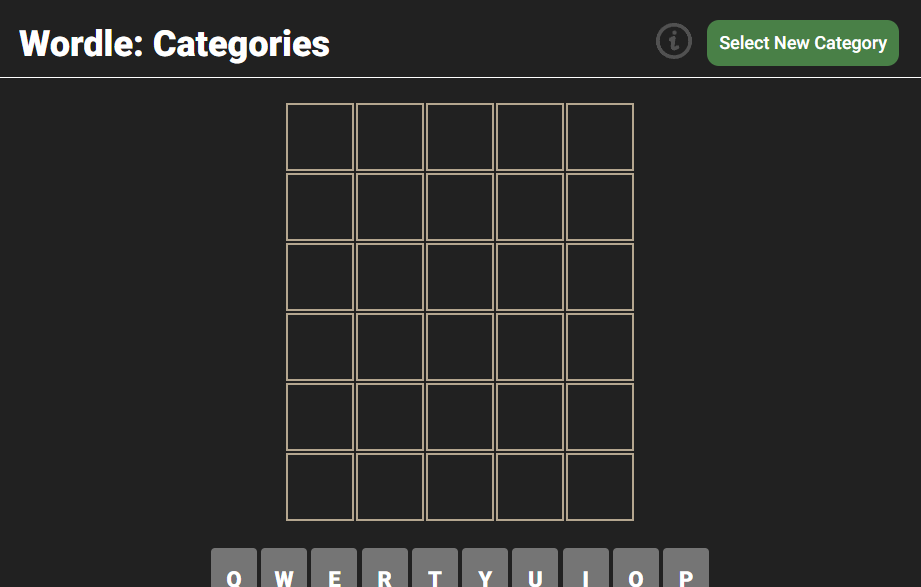

# Wordle: Categories

Software Engineering Bootcamp (June 2024) 
Project Assignment 1 - [General Assembly](https://generalassemb.ly/)

## Overview

Wordle is a web-based word game developed by Josh Wardle and was massively trending online in 2023. 

