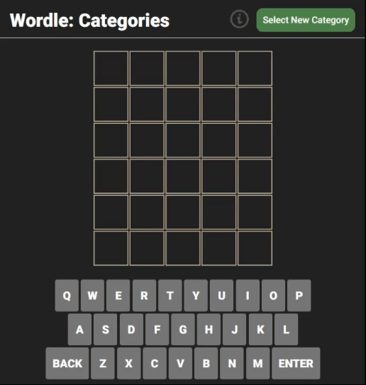
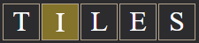

# Wordle: Categories

Software Engineering Bootcamp (June 2024) 
Project Assignment 1 - [General Assembly](https://generalassemb.ly/) 
Play [Wordle: Categories](https://jpham4801.github.io/wordle-game/)!

## About the Project

This project aims to demonstrate my current understanding of *HTML*, *CSS*, and *JavaScript* by building a functional game. I chose to recreate the popular web-based word game, ***[Wordle](https://www.nytimes.com/games/wordle/index.html)***, with a twist: allowing players to select different word categories.

While the original Wordle game uses only 5-letter words, I designed my version to dynamically generate tiles based on the length of the hidden word, which can vary across different categories. The original game's playable words and valid words were sourced and reconstructed into arrays found in [words.js](https://github.com/JPham4801/wordle-game/blob/main/js/words.js) and [wordlist.js](https://github.com/JPham4801/wordle-game/blob/main/js/wordlist.js). I added categories such as [Colors](https://github.com/JPham4801/wordle-game/blob/main/js/colors.js) and [Fruits & Vegetables](https://github.com/JPham4801/wordle-game/blob/main/js/fruitsAndVegetables.js) to demonstrate the concept.

I selected this game because, despite its simple appearance, it presents nuances and edge cases that are beneficial for developing my current skill set.

### Challenges:

- Implementing the `inputHandler()` function to handle both keyboard key presses and on-screen keyboard clicks
- Dynamically generating tiles based on the chosen category and word length.
- Applying animations sequentially without affecting the variables unexpectedly (e.g., round & row numbers changing before the animation completes).
- Applying color to the tile only after the tile is halfway through its animation for a seamless appearance.
- Naming variables effectively (an art form in itself).

## Getting Started
The premise of the original ***Wordle*** is simple. To win, you must:
- Guess the hidden word in 6 tries or less.
- Each guess must be a valid 5-letter word.

The color of the tiles change to indicate how close your guess was to the hidden word.

*Green* tiles means the letter ***is*** in the word and ***is*** in the correct position.

*Yellow* tiles means the letter ***is*** in the word but ***is not*** in the correct position.

*Gray* tiles means the letter ***is not*** in ***any*** of the positions in the word.

### Wordle: Categories variation

- Allows selection of categories with words of varying lengths.

Ready to play [Wordle: Categories](https://jpham4801.github.io/wordle-game/) or the original [Wordle](https://www.nytimes.com/games/wordle/index.html)?

[Original planning materials](https://github.com/JPham4801/wordle-game/blob/main/planning-material.md)

## Attributions

- Game mechanics and designs were inspired by the official Wordle.
    * https://www.nytimes.com/games/wordle/index.html
- Wordle Wiki
    * https://en.wikipedia.org/wiki/Wordle
- Animista
    * https://animista.net/play/
- Profile Header Generator by [leviarista](https://github.com/leviarista)
    * https://leviarista.github.io/github-profile-header-generator/

## Technologies Used

## Next Steps

1. Implement a game mechanic to prevent yellow tiles from appearing if all instances of the indicated letter is already correctly placed in the word.

2. Refactor the code to improve maintainability by reducing the number of if statements, making conditions more concise, and enhancing the readability of code structures.

